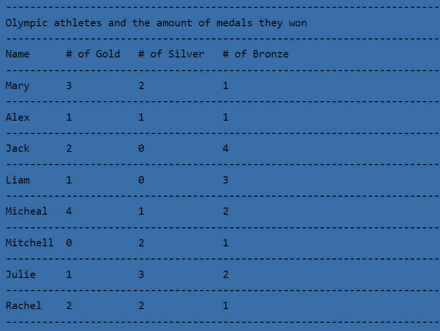

# .csv-to-console

 A program that asks for the path of a .csv file and determines if that file with that path exists. If it does, it prints out a formatted version of the file into the console.

## Table of Contents
- [About](#about)
- [Getting Started](#getting_started)
- [How to Use](#usage)
- [Authors](#authors)
## About 
This program was created in order to enhance my skills in reading and processing csv files and also enhance my skills in Python. This program was written over the span of a one day.
## Getting Started 
What you will need to run this program: 
- <em>Python</em>- To run this program, you must have some way to run a .py file. Also, this program was written using python 3.8.3, and has not been tested using any other version.
- <em>csv file</em>- It should be easy to see that to use this program, you would also need a csv file. If you do not have any, two example csv files have been included.       NOTE - This program was written to read csv files that follow the specific style guide of having the title included in cell 1A, leaving all cells in the rest of row one empty. Expect issues if your csv files do not follow the same style guide. If you're still confused, you can always look at the example csv files included for help on formatting.
## How to Use 
After installing and adding everything necessary, all you need to do is run the program, and enter the path to the csv file you want to use, an example would be "C:\Users\Owner\Downloads\csv example files\Olympic_Medals.csv".
## Author 
[@AlexHettle](https://github.com/AlexHettle) - Sole author of project
